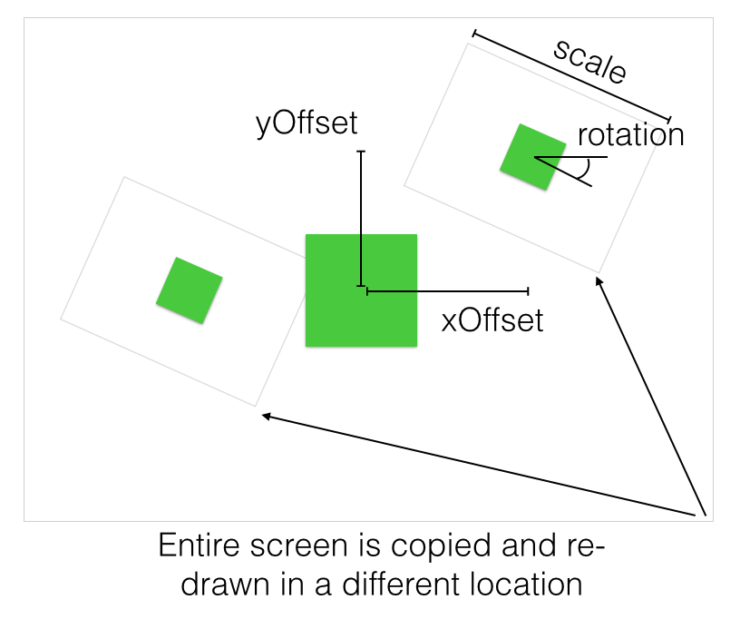

# Fractal Feedback

Uses Three.js/WebGL to recursively grab the screen and render it back slightly transformed. This is similar to video feedback techniques for creating fractals.

# Source

|    Source     |    Description        | 
| ------------- |-------------| 
| index.html       | static page for running the code | 
| src/feedback.js  | all the feedback javasript        | 
| src/libs         | all the javascript libraries used (three.js, etc.)    |   
| threejs-src | redundant source code for three.js (three.min.js is the minimized version actually used). |

## Usage

Open index.html in a WebGL capable browser. A running version is published [here](http://david-hagar.github.io/Fractal-Feedback/) .

The mouse controls various transforms that can be configured by opening the controls panel. Clicking pauses the feedback. Clicking again resumes it. Since the controls are relative to the mouse click location you can use this to get larger or smaller values when the mouse runs off the window ( to get mor space in the lowwer right pause click and then resume click in the upper left. 

More precise control can occur by turning all but one transform setting to "Off". This keeps the transform but the mosue no longer changes it.

## Example

[Gallery of examples ...](gallery/gallery.md)

## How it works

Process
  1. copy the whole screen to an offscreen canvas
  2. draw the center seed shape (simple circle or square)
  3. draw the offscreen canvas rotated and scaled, once for transform 1 and once for transform 2
  4. repeat process

The controls just modify how the mouse position changes the transform.
